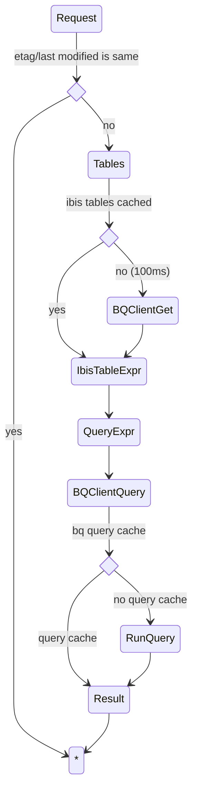

# BigQuery

Performance optimisations for BigQuery:

- Enable [BI Engine](https://cloud.google.com/bi-engine/docs/introduction) to
  speed up interactive queries
- Enable [query cache](https://cloud.google.com/bigquery/docs/cached-results)
  API setting for caching duplicate queries (default)
- Write a faster [BigQuery client](apps/base/clients.py) using the synchronous
  [query](https://cloud.google.com/bigquery/docs/reference/rest/v2/jobs/query)
  REST API, rather than job creation plus waiting in separate API requests.
- Write the code to avoid more than one request to BigQuery query endpoint,
  unless it is actually unavoidable.
- Cache the Ibis schema for our table models, using `data_updated` for cache
  invalidation.
- Use etag/last modified headers to cache on the client (browser), if the
  computed data for a view is unchanged, again using `data_updated` of each
  table plus the hash of the computation applied to the tables.

