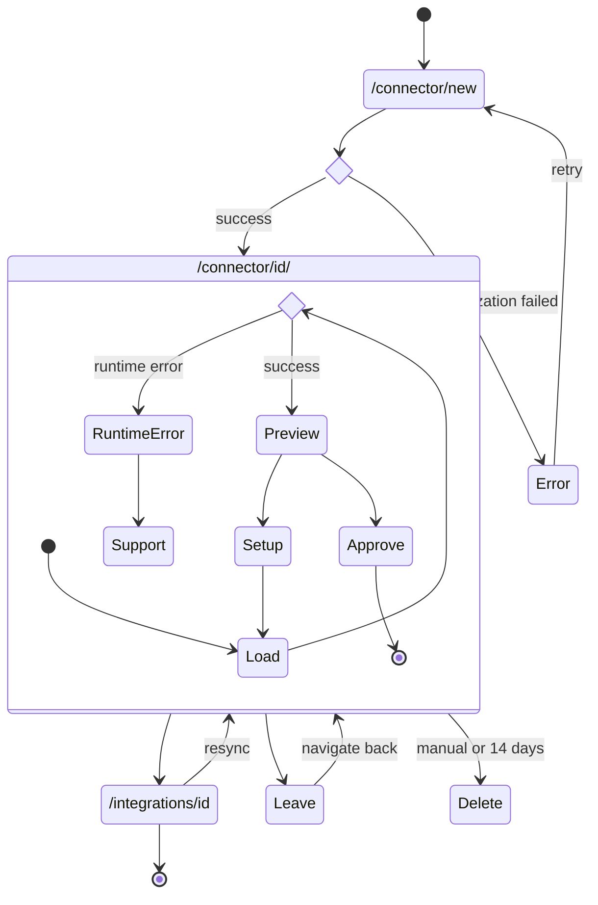

```mermaid
stateDiagram-v2
    New: /connector/new
    Connector: /connector/id/
    Integration: /integrations/id

    state if_state <<choice>>
    [*] --> New
    New --> if_state
    if_state --> Error: fivetran authorization failed
    if_state --> Connector: success
    Error --> New: retry

    state Connector {
        state if_load <<choice>>
        [*] --> Load
        Setup --> Load
        Load --> if_load
        if_load --> RuntimeError: runtime error
        if_load --> Preview: success
        RuntimeError --> Support
        Preview --> Setup
        Preview --> Approve
        Approve --> [*]
    }

    Connector --> Leave
    Leave --> Connector: navigate back

    Connector --> Delete: manual or 14 days
    Connector --> Integration
    Integration --> [*]
    Integration --> Connector: resync

```

If tables are de-selected in setup stage after initial sync, manually delete in BigQuery.
