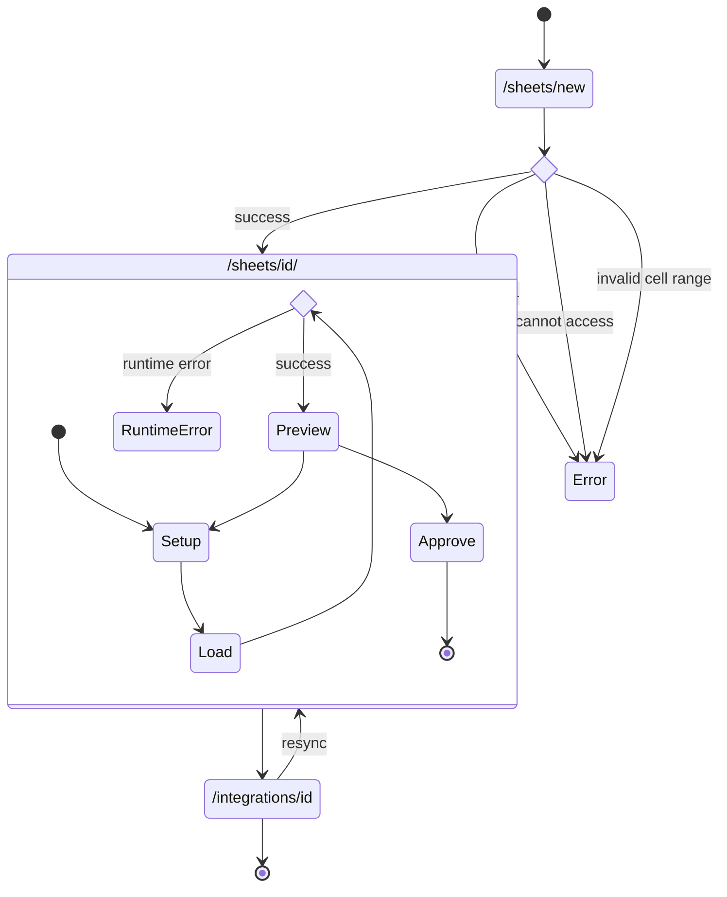

```mermaid
stateDiagram-v2
    New: /sheets/new
    Sheet: /sheets/id/
    Integration: /integrations/id

    state if_state <<choice>>
    [*] --> New
    New --> if_state
    if_state --> Error: invalid URL
    if_state --> Error: cannot access
    if_state --> Error: invalid cell range
    if_state --> Sheet: success

    state Sheet {
        state if_load <<choice>>
        [*] --> Setup
        Setup --> Load
        Load --> if_load
        if_load --> RuntimeError: runtime error
        if_load --> Preview: success
        Preview --> Setup
        Preview --> Approve
        Approve --> [*]
    }

    Sheet --> Integration
    Integration --> [*]
    Integration --> Sheet: resync
```
